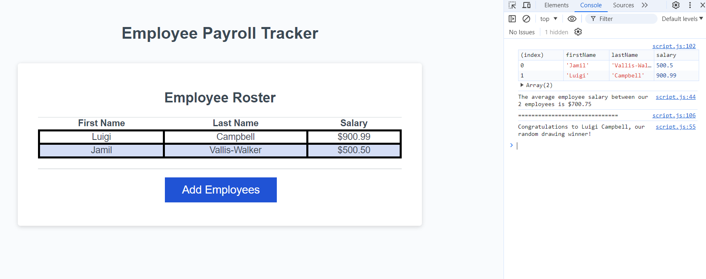

# Employee Payroll Tracker Starter Code

In this assignment, we fix/create the methods in the provided code so that a user can enter employee information (First Name, Last Name, and Salary) via a scren prompt.

After entering one or more employees, the entered data is displayed on the Employee Roster section of the page. Furthermore, in the console, the average salary of the entered employees is logged, as is a randomly selected "drawing winner."

### Link to Application

Here is the link to the live application: https://jvalliswalker.github.io/C3-Employee-Payroll-Tracker/